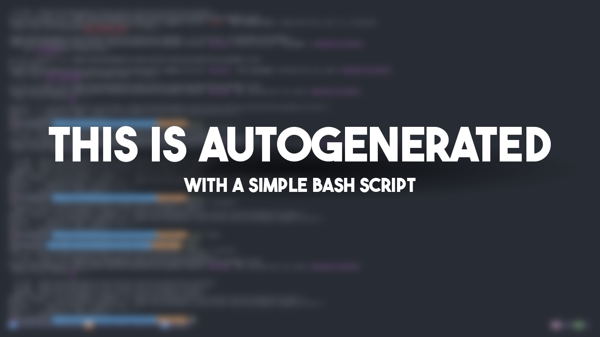

# youtube-miniature-generator

> Why spending 30 seconds to do something when you can spend 5 hours automating it?
> -- A programmer

This is a bash script to automatically generate youtube thumbnails. It takes a video,
a title and a subtitle. It will take a random frame from the video, blur it and
add the text with a little shadow behind.

## Usage

```bash
./generate.sh test_video.mkv "THIS IS AUTOGENERATED" "WITH A SIMPLE BASH SCRIPT"
```




## Dependencies

- `ffmpeg` to take a random frame from a video

- `Imagemagick` to write the text

- `Firefox` to open the image
